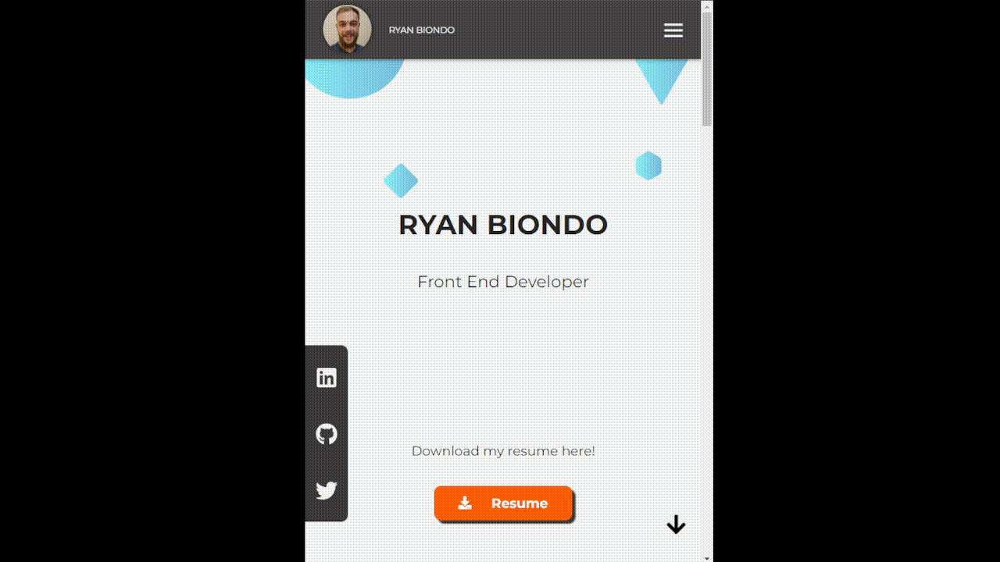

# **Ryan Biondo's Portfolio**

My personal portfolio showcasing my projects and skills as a web developer.
You can view the live version of my portfolio [here](ryanbiondo.com).

## **Project Overview**

This portfolio is a React-based single-page web application. It displays my work, my skills, and a way to get in touch with me.

## **Demo**



## **Technologies Used**

- React.js
- TypeScript
- CSS Modules
- React Icons

## **Features**

- Smooth scrolling navigation
- Responsive design

## **Project Structure**

```
biondo-portfolio
├── .eslintrc.cjs
├── .gitignore
├── dist
│   ├── ...
├── index.html
├── LICENSE
├── package-lock.json
├── package.json
├── public
│   └── vite.svg
├── README.md
├── src
│   ├── App.css
│   ├── App.tsx
│   ├── assets
│   │   └── react.svg
│   ├── components
│   │   ├── AboutMe.module.css
│   │   ├── AboutMe.tsx
│   │   ├── Contact.module.css
│   │   ├── Contact.tsx
│   │   ├── Footer.module.css
│   │   ├── Footer.tsx
│   │   ├── Intro.module.css
│   │   ├── Intro.tsx
│   │   ├── NavBar.module.css
│   │   ├── NavBar.tsx
│   │   ├── Projects.module.css
│   │   ├── Projects.tsx
│   │   ├── Socials.module.css
│   │   └── Socials.tsx
│   ├── images
│   │   ├── backgroundportfolio.png
│   │   ├── backgroundportfolioalter.png
│   │   ├── physcirascreenshot.png
│   │   ├── profilepic.jpg
│   │   └── Ryan-Biondo-Resume.pdf
│   ├── index.css
│   ├── main.tsx
│   └── vite-env.d.ts
├── tsconfig.json
├── tsconfig.node.json
└── vite.config.ts
```

## **Development Process**

I faced a few challenges including handling responsiveness, implementing a custom cursor effect, and dealing with image imports in React. I have overcome these challenges by reading documentation, and asking for help from my peers.

## **Future Enhancements**

- Include a blog section to share my learning experiences and technical knowledge.
- Add a Case Study page to each project.

## **Getting Started**

To run this project locally, you'll need Node.js and npm installed. Here are the steps to get started:

1. Clone this repository: `git clone https://github.com/username/repo.git`
2. Navigate to the project folder: `cd repo`
3. Install dependencies: `npm install`
4. Start the server: `npm start`

## **Usage**

Just visit the live version of my portfolio [here](ryanbiondo.com).

## **Contributing**

This is a personal project and I'm not currently accepting contributions.

## **License**

This project is licensed under the MIT License.

## **Acknowledgments**

- [React Icons](https://react-icons.github.io/react-icons/)
- My friend Sean Craig for support and guidance.
- Danny Thompson who inspired me to create a more professional and readable portfolio.
